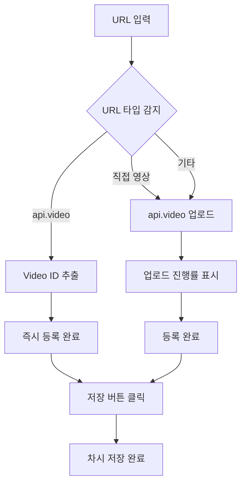

# 📹 3가지 영상 업로드 방식 가이드

## 🎯 개요

차시 관리에서 **3가지 독립적인 탭**으로 영상을 업로드할 수 있습니다!

```
┌─────────────┬─────────────┬─────────────┐
│ 🎥 YouTube  │ 📁 파일 업로드 │ 🔗 URL 업로드 │
└─────────────┴─────────────┴─────────────┘
```

---

## 🚀 사용 방법

### 1️⃣ 관리자 페이지 접속

```
https://mindstory-lms.pages.dev/admin/courses
```

**로그인 정보:**
- Email: `admin-test@gmail.com`
- Password: `admin123456`

---

### 2️⃣ 강좌 선택 → 차시 관리

1. 강좌 목록에서 원하는 강좌 선택
2. **"차시 관리"** 버튼 클릭
3. **"새 차시 추가"** 또는 기존 차시 **"수정"** 클릭

---

### 3️⃣ 영상 업로드 방법 선택 (3개 탭)

**영상 설정** 섹션에서 **3개의 탭** 중 하나를 선택합니다:

```
┌─────────────┬─────────────┬─────────────┐
│ 🎥 YouTube  │ 📁 파일 업로드 │ 🔗 URL 업로드 │
└─────────────┴─────────────┴─────────────┘
```

---

## 🎥 방법 1: YouTube 탭

YouTube에 업로드된 영상을 연결합니다.

### 사용 순서:
1. **"YouTube"** 탭 클릭 (기본 선택됨)
2. YouTube 영상 URL 입력
3. 차시 정보 입력 후 **"저장"** 버튼 클릭

### 특징:
- 무료, 무제한 저장 공간
- 공개/비공개/일부 공개 모두 가능
- 빠른 로딩 속도

---

## 📁 방법 2: 파일 업로드 탭

컴퓨터에 저장된 영상 파일을 업로드합니다.

### 사용 순서:
1. **"파일 업로드"** 탭 클릭
2. 파일 선택 또는 드래그 앤 드롭
3. 업로드 진행률 확인
4. 업로드 완료 후 **"저장"** 버튼 클릭

### 지원 형식:
- MP4, WebM, MOV, AVI
- 최대 500MB
- api.video에 자동 업로드 (비공개 설정)

---

## 🔗 방법 3: URL 업로드 탭 (신규!)

외부 영상 URL을 입력하여 등록합니다.

### 사용 순서:
1. **"URL 업로드"** 탭 클릭
2. 영상 URL 입력
3. **"URL 등록"** 버튼 클릭
4. 등록 완료 후 **"저장"** 버튼 클릭

---

## 🎥 지원하는 URL 형식

### 1) api.video URL ✅

직접 등록됩니다 (빠름!)

```
https://embed.api.video/vod/vi3rrqCvFbkHxv3yavOIF45q
https://vod.api.video/vi3rrqCvFbkHxv3yavOIF45q
```

**사용 예시:**
- api.video 대시보드에서 업로드한 영상
- Player URL 복사 → LMS에 붙여넣기

---

### 2) 직접 영상 URL ✅

api.video로 자동 업로드됩니다.

```
https://example.com/video.mp4
https://cdn.example.com/videos/lesson1.webm
```

**지원 확장자:**
- `.mp4`
- `.webm`
- `.mov`
- `.avi`
- `.mkv`
- `.flv`

---

### 3) 기타 URL 🔄

api.video로 업로드를 시도합니다.

```
https://file-examples.com/wp-content/uploads/2017/04/file_example_MP4_480_1_5MG.mp4
```

---

## 📊 URL 업로드 프로세스



---

## 🎬 실제 사용 예시

### 예시 1: api.video에서 업로드한 영상 가져오기

1. **api.video 대시보드 접속**
   ```
   https://dashboard.api.video/videos
   ```

2. **업로드한 영상 선택**
   - 영상 클릭 → Player URL 복사
   - 예: `https://embed.api.video/vod/vi3rrqCvFbkHxv3yavOIF45q`

3. **LMS에서 차시 관리**
   - 직접 업로드 탭 → URL 입력 버튼 클릭
   - URL 붙여넣기 → URL 등록 클릭
   - 저장 버튼 클릭

4. **완료!** ✅

---

### 예시 2: 외부 서버의 영상 파일 가져오기

1. **영상 파일 URL 확보**
   ```
   https://cdn.example.com/courses/lesson1.mp4
   ```

2. **LMS에서 차시 관리**
   - 직접 업로드 탭 → URL 입력 버튼 클릭
   - URL 붙여넣기 → URL 등록 클릭
   - ⏳ 업로드 진행률 표시 (api.video로 자동 업로드)
   - 저장 버튼 클릭

3. **완료!** ✅

---

## 🔍 URL 등록 시 자동 처리

### api.video URL인 경우:
```javascript
✅ api.video URL 감지
→ Video ID 추출 (vi3rrqCvFbkHxv3yavOIF45q)
→ 즉시 등록 완료 (업로드 불필요)
```

### 직접 영상 URL인 경우:
```javascript
🎥 직접 영상 URL 감지
→ api.video로 업로드 시작
→ 진행률 표시 (0% → 50% → 100%)
→ 등록 완료
```

---

## 💡 FAQ

### Q1: 각 탭은 언제 사용하나요?

**탭별 사용 시나리오:**

```
[YouTube 탭]         → YouTube에 이미 업로드된 영상
[파일 업로드 탭]     → 컴퓨터에 있는 영상 파일
[URL 업로드 탭]      → api.video 또는 다른 서버의 영상 URL
```

---

### Q2: URL 업로드 시간은 얼마나 걸리나요?

| URL 타입 | 소요 시간 |
|----------|----------|
| api.video URL | **즉시** (Video ID만 추출) |
| 직접 영상 URL | 파일 크기에 따라 **1분~5분** |

---

### Q3: 업로드 실패 시 어떻게 하나요?

**확인 사항:**
1. URL이 올바른지 확인
2. 영상 파일에 직접 접근 가능한지 확인
3. 파일 형식이 지원되는지 확인 (.mp4, .webm, .mov 등)

**해결 방법:**
- 브라우저 콘솔 확인 (F12 → Console 탭)
- api.video 대시보드에서 직접 업로드 후 URL 복사
- 파일 업로드 방식 사용

---

### Q4: 비공개 영상도 가능한가요?

**네!** api.video는 기본적으로 **비공개 영상**으로 설정됩니다.

```javascript
{
  is_public: false  // ✅ 비공개 설정
}
```

---

## 🎉 완료된 기능

✅ 파일 업로드 (기존)  
✅ URL 입력 (신규)  
✅ api.video URL 자동 감지  
✅ 직접 영상 URL 자동 업로드  
✅ 업로드 진행률 표시  
✅ 에러 핸들링  

---

## 🔜 향후 계획

🔄 일괄 URL 업로드 (여러 URL 동시 입력)  
🔄 FTP/S3 URL 지원  
🔄 자동 썸네일 추출  

---

## 📞 문의

문제가 발생하면 브라우저 콘솔을 확인하세요:

```
F12 → Console 탭
```

**주요 로그 메시지:**
- `🔗 URL 업로드 시작`
- `✅ api.video URL 감지 → 직접 등록`
- `🎥 직접 영상 URL 감지 → api.video로 업로드`
- `✅ URL 업로드 완료`
- `❌ URL 업로드 오류`

---

## 🎯 빠른 테스트

### 테스트 URL:
```
https://embed.api.video/vod/vi3rrqCvFbkHxv3yavOIF45q
```

### 테스트 순서:
1. https://mindstory-lms.pages.dev/admin/courses 접속
2. 로그인 (admin-test@gmail.com / admin123456)
3. 강좌 선택 → 차시 관리 → 새 차시 추가
4. 직접 업로드 탭 → **URL 입력** 버튼 클릭
5. 위 테스트 URL 입력 → **URL 등록** 클릭
6. ✅ 등록 완료 메시지 확인
7. 차시 정보 입력 후 **저장** 클릭

---

## 📊 3가지 방식 비교표

| 기능 | YouTube 탭 | 파일 업로드 탭 | URL 업로드 탭 |
|------|-----------|--------------|-------------|
| **사용 사례** | YouTube 영상 | 로컬 파일 | 외부 URL |
| **소요 시간** | 즉시 | 파일 크기 따라 | api.video URL은 즉시 |
| **용량 제한** | 무제한 | 500MB | 제한 없음 (api.video 기준) |
| **일괄 업로드** | ❌ | ✅ 지원 | 🔜 예정 |
| **드래그 앤 드롭** | ❌ | ✅ 지원 | ❌ |
| **비용** | 무료 | api.video 요금 | api.video 요금 |

---

## 🎊 결론

이제 **3개의 독립적인 탭**으로 영상을 업로드할 수 있습니다:
1. 🎥 **YouTube** - YouTube URL
2. 📁 **파일 업로드** - 로컬 파일
3. 🔗 **URL 업로드** - api.video/직접 영상 URL

더 깔끔하고 직관적인 UI로 개선되었습니다! 🎉

---

**배포 정보:**
- **Production URL**: https://mindstory-lms.pages.dev
- **Latest URL**: https://6c418f8e.mindstory-lms.pages.dev
- **문서 작성일**: 2025-12-31
